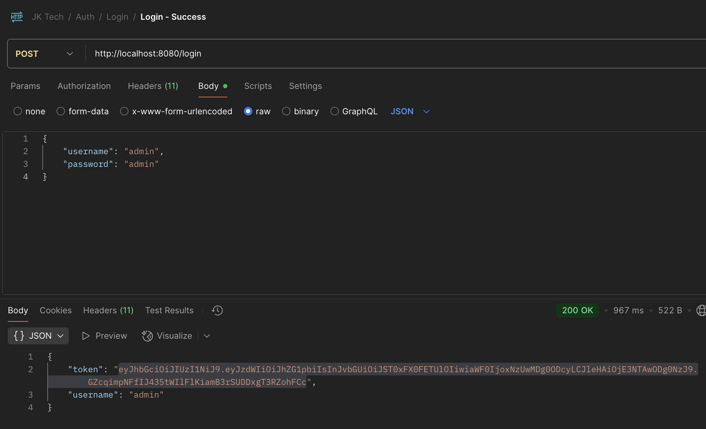
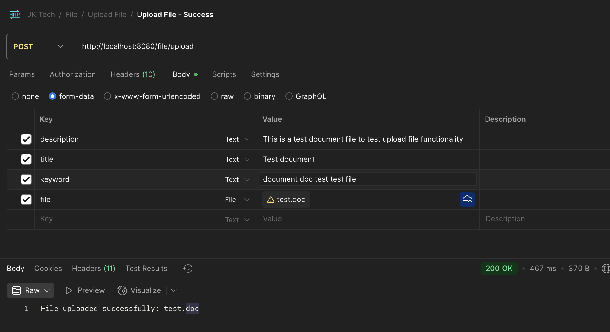
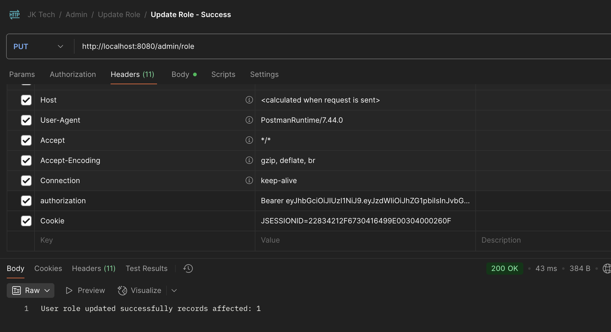
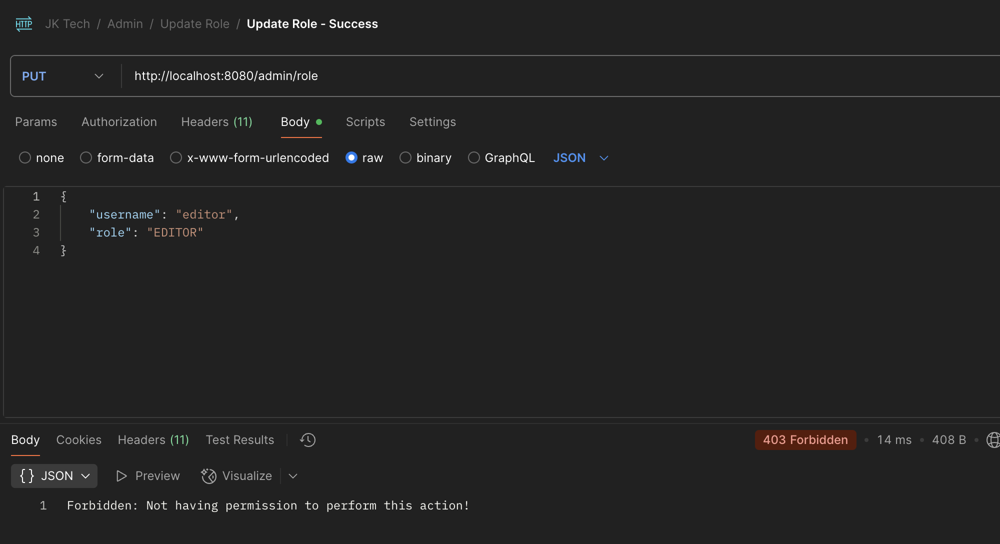
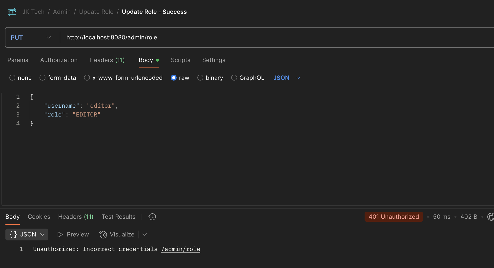
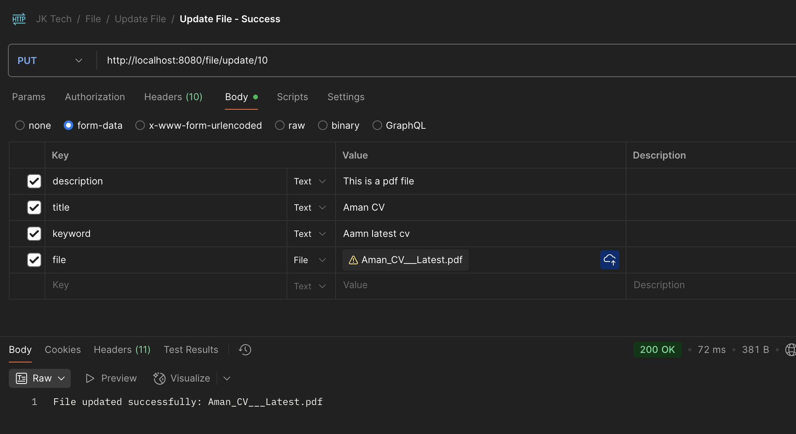
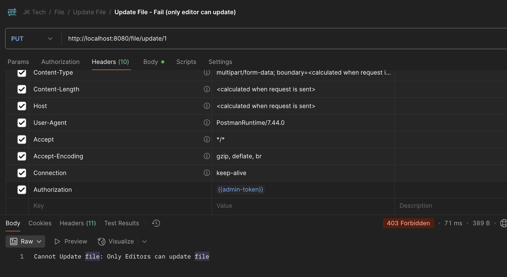

# 📄 Docu-Sphere

> A secure, scalable document management and intelligent retrieval platform built with Spring Boot 3.5.0 and Java 17. DocuSphere provides secure document ingestion, role-based access control, document metadata management, caching, and intelligent question-and-answer capabilities.

---

## 🚀 Features

### 🔐 Authentication & Authorization
- User Registration & Login
- JWT-based Authentication
- Role-based Authorization: `ADMIN`, `EDITOR`, `VIEWER`
- Secure endpoint authorization using Spring Security
- Token-based access to protected APIs

### 👤 User Management
- Register and login users as a viewer or editor
- Administrators can:
    - Delete users
    - Modify user roles
    - Control access to document operations

### 📁 Document Management
 DocuSphere provides APIs for complete document lifecycle management:
- Upload documents
- Update documents
- Delete documents
- View documents by file ID
- Retrieve metadata by:
    - `fileId`
    - `editorId`
    - `keyword`
    - `fileType`

### 🧠 Intelligent Question & Answer
 DocuSphere provides a question-and-answer capability that can identify and retrieve the most relevant document(s) based on a user's question.
 This functionality provides a foundation for extending the application toward:

- Semantic document search
- Vector databases
- Embedding-based retrieval
- RAG-based document Q&A
- LLM-powered document assistants

### ⚡ Caching

Redis is used for caching frequently accessed data to improve application performance and reduce unnecessary database queries.

### 🛢️ Persistence
- PostgreSQL for persistent application data
- Redis for caching
- JPA/Hibernate for database interaction
- HikariCP for database connection pooling

---

## 🧰 Tech Stack

| Technology           | Purpose                          |
|----------------------|----------------------------------|
| Java 17              | Application development          |
| Spring Boot 3.5.0    | Backend framework                |
| Spring Security      | Authentication & authorization   |
| JWT (JSON Web Token) | Stateless authentication         |
| Spring Data JPA      | Database persistence             |
| Hibernate            | ORM                              |
| PostgreSQL           | Primary database                 |
| Redis                | Caching                          |
| Maven                | Build & dependency management    |
| Docker               | Containerization                 |
| Docker Compose       | Local multi-container deployment |
| Swagger / OpenAPI    | API documentation                |
| Postman              | API testing                      |

---


## 👥 Roles & Permissions

| Role     | Permissions                                                                              |
|----------|------------------------------------------------------------------------------------------|
| `ADMIN`  | Full access, user management, role management, and document management                   |
| `EDITOR` | Upload docuement, view all documents, and update documents they are authorized to modify |
| `VIEWER` | View documents and retrieve document metadata                                            |

Authorization is enforced at the API level using Spring Security and JWT-based authentication.

---

## 🛠️ Getting Started

### Prerequisites
Before running DocuSphere locally, make sure you have:
- Java 17
- Maven
- PostgreSQL
- Redis Server
- Docker (optional)

Verify Java:
```
java -version
```
Verify Maven:
```
mvn -version
```

### 🛠️ Local Setup

1. Clone the Repository

`git clone https://github.com/Aman-sharma02/docusphere.git`

`cd docusphere`
2. Configure PostgreSQL

Database Setup

Create a PostgreSQL database (docusphere) and configure the application using environment variables in `application.properties`:

```properties
# PostgreSQL Configuration
spring.datasource.url=${DB_URL}
spring.datasource.username=${DB_USERNAME}
spring.datasource.password=${DB_PASSWORD}
```

3. Redis Setup

Start a local Redis server and configure the application using environment variables in `application.properties`:

```properties
# Redis Configuration
spring.data.redis.host=${REDIS_HOST}
spring.data.redis.port=${REDIS_PORT}
spring.data.redis.username=${REDIS_USERNAME}
spring.data.redis.password=${REDIS_PASSWORD}
spring.data.redis.ssl.enabled=${REDIS_SSL_ENABLED}
```

> Security: Never commit database passwords, JWT secrets, Redis passwords, API keys, or other credentials to Git.

## ▶️ Running the Application

Build the application:

`mvn clean install`

Run the application:

`mvn spring-boot:run`

The application will be available at:

`http://localhost:8080`

---

## 📑 API Documentation

DocuSphere exposes interactive API documentation through **Swagger UI**.

After starting the application, open:

👉 [Swagger UI](http://localhost:8080/swagger-ui/index.html)

Swagger provides an interactive interface for:

- Authentication APIs
- User management APIs
- Document APIs
- Metadata APIs
- Question-and-answer APIs
- Authorization testing

## 🔑 Authentication

For all protected endpoints, include the JWT token in the request header:
> Authorization: Bearer <your_jwt_token>

## 🧪 Testing

Run the complete test suite:

`mvn test`

For API-level testing, a Postman collection is available under:
`docs/`

## 📬 Postman Collection
The repository contains a sample Postman collection for testing the application APIs.

Example scenarios include:

- User registration
- User login
- JWT authentication
- Document upload
- Document update
- Document retrieval
- Document deletion
- Metadata search
- Role modification
- Unauthorized access
- Forbidden access

## 📷 Screenshots

### - Login API (Authenticates a user and returns a JWT token)
- 🟢 Success
  

### - Upload File API (Uploads a new file and stores in DB)
- 🟢 Success
  

### - Update Role API (Updates the role of a specific user identified by username)
- 🟢 Success
  

- 🔴 Getting **403** as we are updating roles with VIEWER role. Required ADMIN user role
  

- 🔴 Getting **401** as we are updating roles without token. Required jwt token
  

### - Update File API (Updates the specific file identified by id)
- 🟢 Success
  

- 🔴 Getting **403** as we are updating file with other editor. Required respective file editor to update file.
  

> Additional screenshots are available in the `docs/screenshots` folder for reference.

--- 

## 🐳 Docker
DocuSphere can be containerized along with PostgreSQL and Redis using Docker Compose

### 1. Configure Environment Variables
Example configuration:
```properties
spring.datasource.url=jdbc:postgresql://${DB_HOST}:${DB_PORT:5432}/${DB_NAME:DocuSphere}
spring.datasource.username=${DB_USER}
spring.datasource.password=${DB_PASSWORD}
spring.data.redis.host=${REDIS_HOST}
spring.data.redis.password=${REDIS_PASSWORD}
spring.data.redis.port=${REDIS_PORT:6379}
```

### 2. Build the Application JAR
`mvn clean package`

Make sure the .jar file exists in the `/target` folder before continuing.

### 3. Build and Run the Docker Containers

Start the containers:

`docker-compose up --build`

Docker Compose will start:
````
┌──────────────────────────────┐
│        DocuSphere App        │
│       Spring Boot :8080      │
└──────────────┬───────────────┘
               │
      ┌────────┴────────┐
      ▼                 ▼
┌──────────────┐  ┌──────────────┐
│  PostgreSQL  │  │    Redis     │
│    :5432     │  │    :6379     │
└──────────────┘  └──────────────┘
````
The application will be available at:

``http://localhost:8080``

Stop the containers:

```docker-compose down```

---

## ☁️ Future Deployment to AWS EC2, RDS and Redis

DocuSphere can be deployed on AWS using:

- EC2 — application hosting
- RDS PostgreSQL — managed database
- ElastiCache for Redis — managed caching
- Security Groups — network access control

A typical deployment architecture:
````
                    Internet 
                       │ 
                       ▼ 
               ┌───────────────┐ 
               │ AWS EC2       │
               │ DocuSphere    │ 
               │ Spring Boot   │ 
               └───────┬───────┘ 
                       │ 
            ┌──────────┴──────────┐ 
            │                     │ 
            ▼                     ▼ 
      ┌─────────────┐       ┌─────────────┐ 
      │ AWS RDS     │       │ ElastiCache │ 
      │ PostgreSQL  │       │ Redis       │ 
      └─────────────┘       └─────────────┘
````

Follow these steps to deploy your Spring Boot Document Ingestion application on AWS:

### 1. Prepare the AWS RDS (PostgreSQL) Database

Create a PostgreSQL database using Amazon RDS.

Configure:

- Database name
- Master username
- Password
- Instance class
- Storage
- VPC
- Security groups

The application should be configured using environment variables:
```
DB_HOST = <rds-endpoint> 
DB_PORT = 5432 
DB_NAME = docusphere 
DB_USER = <rds-username> 
DB_PASSWORD = <rds-password>
```

### 2. Prepare the Amazon ElastiCache for Redis

For production environments, use Amazon ElastiCache for Redis or an equivalent managed Redis service.

Example:
```
REDIS_HOST=<redis-endpoint>
REDIS_PORT=6379
REDIS_PASSWORD=<redis-password>
```

### 3. Launch an EC2 Instance

Launch an EC2 instance using an appropriate Linux AMI.

Configure the security group to allow only the required traffic.

Typical configuration:

| Port               | Purpose      | Recommended Access               |
|--------------------|--------------|----------------------------------|
| `22`               | SSH          | Your IP only                     |
| `8080`             | Spring Boot  | Application users/load balancer  |
| `5432`             | PostgreSQL   | RDS/EC2 security group only      |
| `6379`             | Redis        | Application security group only  |

> Avoid exposing PostgreSQL or Redis directly to the public internet.

### 4. Install Java

Example for an Amazon Linux environment:

`sudo dnf install -y java-17-amazon-corretto`

Verify:

`java -version`

### 5. Build the Application

`mvn clean package`

Transfer the generated JAR to EC2:
```bash
scp -i /path/to/your-key.pem \
target/docusphere.jar \
ec2-user@<ec2-public-ip>:~
```
### 5. Run DocuSphere Spring Boot Application on EC2

- Configure the required environment variables:
```
export DB_URL=<rds-endpoint>
export DB_USERNAME=<database-user>
export DB_PASSWORD=<database-password>

export REDIS_HOST=<redis-endpoint>
export REDIS_PORT=6379
export REDIS_USERNAME=<redis-username>
export REDIS_PASSWORD=<redis-password>
```

- Start the app

`java -jar docusphere.jar`

---

## 🔒 Security Considerations

DocuSphere uses JWT authentication and role-based authorization to protect APIs.

For production deployments:

- Store secrets in environment variables or AWS Secrets Manager
- Never commit credentials to Git
- Use HTTPS/TLS
- Restrict database network access
- Restrict Redis network access
- Use strong JWT signing secrets
- Rotate credentials periodically
- Apply least-privilege IAM policies
- Avoid exposing internal infrastructure publicly
- Use secure file validation and size limits for uploads

---

## 📄 License

This project is intended for learning, development, and demonstration purposes.

---

## 👨‍💻 Author

### Aman Sharma

Senior Software Engineer | Java | Spring Boot | AWS | Docker | Kubernetes | PostgreSQL | Redis
